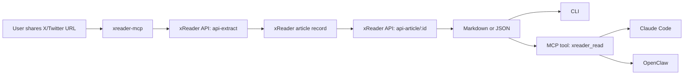

<p align="center">
  
</p>

<h1 align="center">xreader-mcp</h1>

<p align="center">
  <strong>The official xReader.ai bridge for MCP, CLI, Claude Code, and OpenClaw.</strong>
</p>

<p align="center">
  Turn supported X/Twitter links into clean, AI-readable context your agents can actually reason over.
</p>

<p align="center">
  <a href="https://github.com/rushindrasinha/xreader-mcp"></a>
  <a href="https://github.com/rushindrasinha/xreader-mcp/commits/main/"></a>
  
  
  
</p>

<p align="center">
  <a href="#why-this-exists">Why</a> •
  <a href="#quick-start">Quick Start</a> •
  <a href="#mcp-usage">MCP</a> •
  <a href="#claude-code-setup">Claude Code</a> •
  <a href="#openclaw-setup">OpenClaw</a> •
  <a href="#screenshots">Screenshots</a>
</p>

---

## Why this exists

xReader already makes X/Twitter content readable for humans.

`xreader-mcp` makes it usable for agents.

Instead of handing your model a messy social URL, you hand it:
- the cleaned markdown body
- structured article metadata
- a reusable MCP tool
- skill packaging for Claude Code and OpenClaw

That means better summaries, stronger repurposing workflows, cleaner Q&A, and far less brittle browsing.

## What this repo gives you

- **CLI wrapper** for local fetch/read workflows
- **stdio MCP server** exposing `xreader_read`
- **Claude Code skill** ready to install
- **OpenClaw skill** ready to install
- **config examples** for both ecosystems
- **screenshots and docs** for onboarding, demos, and sharing

## Why use this vs raw URLs?

| Approach | What the model sees | Reliability | Best for |
|---|---|---:|---|
| Raw X/Twitter URL | social UI + timeline chrome | low | ad hoc browsing |
| Browser scraping | partial DOM / rendering-dependent | medium | one-off extraction |
| `xreader-mcp` | clean parsed article markdown | high | agent workflows, summaries, repurposing, skill use |

## Supported inputs

- `https://x.com/.../status/...`
- `https://twitter.com/.../status/...`
- `https://x.com/.../article/...`
- `https://xreader.ai/article/<uuid>`

## Supported outputs

- **Markdown** — best for direct LLM context
- **JSON** — best for chained workflows and structured consumers

## Powered by xReader's first-party API

This repo uses xReader's official API layer:
- `api-extract`
- `api-article/:id`

## Architecture



## Repo structure

```text
xreader-mcp/
├── src/
│   ├── cli.mjs
│   ├── server.mjs
│   └── xreader-client.mjs
├── skills/
│   ├── claude/xreader-fetch/SKILL.md
│   └── openclaw/xreader-fetch/SKILL.md
├── scripts/
│   ├── install-claude-skill.sh
│   └── install-openclaw-skill.sh
├── config/
│   ├── claude-desktop.example.json
│   └── openclaw-mcp.example.json
├── docs/
│   ├── screenshots/
│   └── skills.md
├── tests/
├── CHANGELOG.md
└── README.md
```

## Quick start

```bash
git clone https://github.com/rushindrasinha/xreader-mcp.git
cd xreader-mcp
npm install
```

### Optional environment variables

```bash
export XREADER_BASE_URL="https://bjcgmkpgrloafihbhvsz.supabase.co/functions/v1"
export XREADER_API_KEY="<your-xreader-api-key>"
```

| Variable | Required | Purpose |
|---|---:|---|
| `XREADER_BASE_URL` | No | Override the xReader API base URL |
| `XREADER_API_KEY` | No | Use your xReader API key for higher limits, usage tracking, and tiered access |
| `XREADER_TIMEOUT_MS` | No | Request timeout in ms (default `30000`) |

## CLI usage

### Read as markdown

```bash
node src/cli.mjs "https://x.com/i/status/2026728386857447851"
```

### Read as JSON

```bash
node src/cli.mjs "https://xreader.ai/article/7d1f0756-2304-465a-ab3e-737c00b4171e" --format json
```

### Typical use cases

- turn a thread into clean model context
- feed parsed output into a content pipeline
- repurpose a thread into a blog post, email, carousel, or video script

## MCP usage

Run the stdio MCP server:

```bash
node src/server.mjs
```

### Exposed tool

#### `xreader_read`

**Arguments**
- `input` — X/Twitter URL, xReader article URL, or raw article UUID
- `format` — `markdown` or `json` (default: `markdown`)

**Best use cases**
- agent summarization
- thread-to-article workflows
- research ingestion
- downstream content generation

## Claude Code setup

### 1) Register the MCP server

Use `config/claude-desktop.example.json` as the base:

```json
{
  "mcpServers": {
    "xreader": {
      "command": "node",
      "args": ["/absolute/path/to/xreader-mcp/src/server.mjs"],
      "env": {
        "XREADER_BASE_URL": "https://bjcgmkpgrloafihbhvsz.supabase.co/functions/v1",
        "XREADER_API_KEY": "<your-xreader-api-key>"
      }
    }
  }
}
```

### 2) Install the Claude Code skill

```bash
./scripts/install-claude-skill.sh
```

Installed to:
- `~/.claude/skills/xreader-fetch/SKILL.md`

### What the Claude skill does

When Claude sees a supported URL, the skill teaches it to:
- route the link through xReader
- fetch the cleaned markdown body
- reason over the parsed article instead of the raw social page

## OpenClaw setup

### 1) Register the MCP server

Use `config/openclaw-mcp.example.json` as the base:

```json
{
  "mcp": {
    "servers": {
      "xreader": {
        "command": "node",
        "args": ["/absolute/path/to/xreader-mcp/src/server.mjs"],
        "env": {
          "XREADER_BASE_URL": "https://bjcgmkpgrloafihbhvsz.supabase.co/functions/v1",
          "XREADER_API_KEY": "<your-xreader-api-key>"
        }
      }
    }
  }
}
```

### 2) Install the OpenClaw skill

```bash
./scripts/install-openclaw-skill.sh
```

Installed to:
- `~/clawd/skills/xreader-fetch/SKILL.md`

### What the OpenClaw skill does

When OpenClaw sees a supported URL, the skill teaches it to:
- use xReader for clean article context
- prefer markdown for reasoning
- call `xreader_read` via MCP when available
- fall back to normal article extraction for unsupported non-X URLs

More detail: [`docs/skills.md`](docs/skills.md)

## Screenshots

### xReader homepage


### xReader reading view


## Verification

### Run tests

```bash
npm test
```

### CLI smoke test

```bash
node src/cli.mjs "https://x.com/i/status/2026728386857447851" | head
```

### MCP smoke test

Expected result:
- MCP client connects
- `xreader_read` is listed
- returned markdown starts with title + metadata header

## Limitations

- intentionally focused on **X/Twitter threads/articles** and existing `xreader.ai/article/...` pages
- not a generic web article parser
- if your deployed API origin changes, update `XREADER_BASE_URL`

## Roadmap

- hosted remote MCP endpoint
- npm package release
- lightweight SDKs
- broader xReader API coverage
- richer metadata and batch endpoints

## Changelog

See [CHANGELOG.md](CHANGELOG.md).

## Final positioning

**xreader-mcp is the official way to bring xReader into modern agent workflows.**
